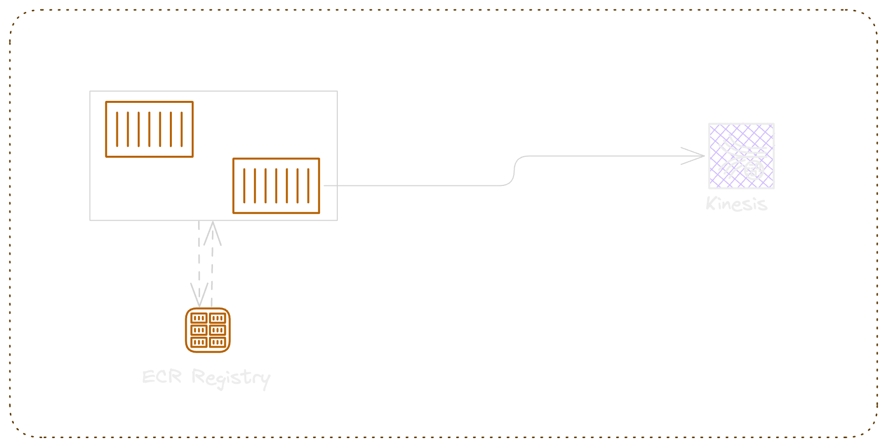

# Sidecar pattern for Logs Aggregation

The repository provide examples to design sidecar pattern while using aws serverless compute services ( Lambda , Fargate ).

source article: [serverless folks](https://serverlessfolks.com/sidecar-pattern-in-serverless-design)

The following scenarios are covered:

- Cloudwatch Subscription Filters
- AWS Lambda Zip package with Extensions
- AWS Lambda Custom Image with Extensions
- AWS Lambda Web Adapter Image with Extensions
- AWS Fargate with sidecar

